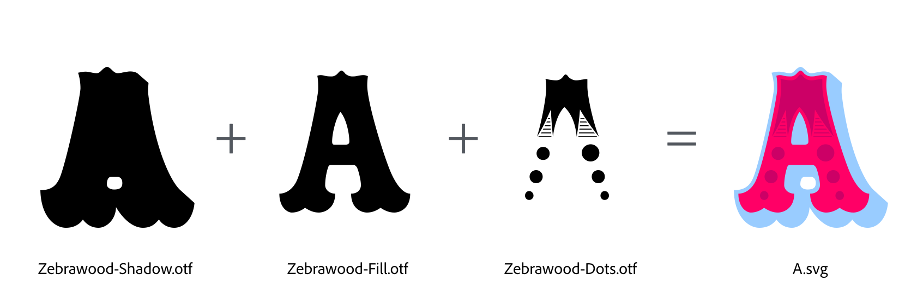
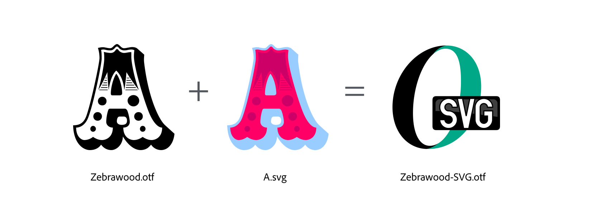

[](https://www.codacy.com/app/adobe-type-tools/opentype-svg?utm_source=github.com&amp;utm_medium=referral&amp;utm_content=adobe-type-tools/opentype-svg&amp;utm_campaign=Badge_Grade)

# Tools for making OpenType-SVG fonts

Dependencies:

- python 2.7 or higher
- [fontTools 3.0](https://github.com/fonttools/fonttools)

## How to make OpenType-SVG fonts?

### Step 1
#### Generate a set of SVG files from a series of fonts and color values.



```sh
$ python fonts2svg.py -c 99ccff,ff0066,cc0066 fonts/Zebrawood-Shadow.otf fonts/Zebrawood-Fill.otf fonts/Zebrawood-Dots.otf
```

### Step 2
#### Add a set of SVG files to an existing OpenType (or TrueType) font.



```sh
$ python addSVGtable.py -s fonts/SVGs fonts/Zebrawood.otf
```

You can use **Step 2** without doing **Step 1**, but there are a few things you need to be aware of when using the `addSVGtable.py` script:

* After the SVG files are saved with the authoring application (e.g. Adobe Illustrator, CorelDRAW!, Inkscape) they should be put thru a process that optimizes and cleans up the SVG code; this will slim down the file size while keeping the resulting artwork the same. For this step you can use one of these tools:
	* [SVG Cleaner](https://github.com/RazrFalcon/svgcleaner-gui/releases) (GUI version)
	* [SVG Cleaner](https://github.com/RazrFalcon/svgcleaner) (command line version)
	* [SVG Optimizer](https://github.com/svg/svgo)

* The script requires the SVG files to be named after the glyphs which they are meant to be associated with. For example, if the glyph in the font is named **ampersand**, the SVG file needs to be named `ampersand.svg`.

* The script expects the color artwork to have been designed at the same size as the glyphs in the font, usually 1000 or 2048 UPM. This means 1 point (pt) in the authoring app equals 1 unit in font coordinates.
